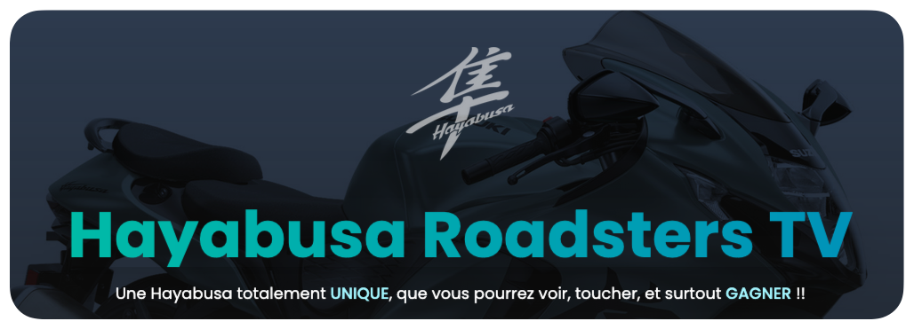

# Projet Hayabusa Rodsters TV

**Citation de Rodolfo :**

>Pour celles et ceux d'entre vous qui me connaissent déjà, vous savez que l'Hayabusa est une machine très, TRES spéciale dans mon coeur.
Tombé amoureux du faucon à l'âge de 9 ans, à sa première sortie, c'est elle qui m'a guidé vers le permis moto, elle a d'ailleurs été ma toute première machine (et je suis encore en vie pour vous le raconter, je sais c'est dingue).
Ayant possédé pas moins de 6 Hayabusa différentes, dont la toute dernière, j'ai décidé de lui rendre hommage, en vous proposant que nous créions ensemble une Hayabusa Rodsters TV totalement folle et unique, dotée des meilleurs équipements, que vous allez pouvoir voir en vrai, et même gagner!

Pour participer : 

https://fr.ulule.com/hayabusa-rodsters-tv/
